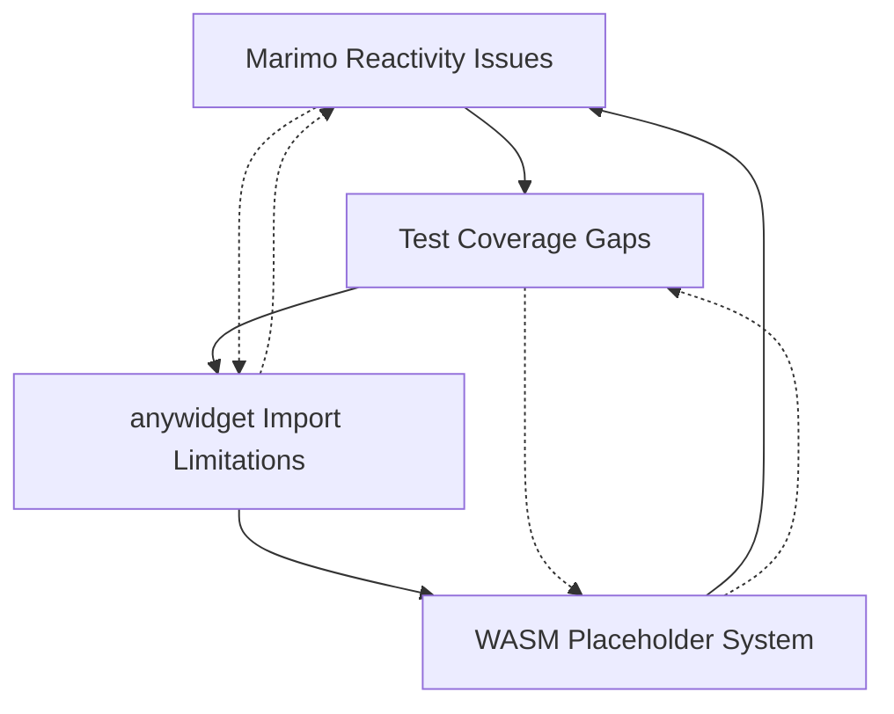

# 🔍 Critical Issues Analysis: Step 5 Architecture Problems

**Analysis Date:** 13. Juni 2025  
**Scope:** Systematic analysis der vier kritischen Probleme aus Step 5 Analysis  
**Status:** ❌ Blocking Production Readiness

## 🎯 **Executive Summary**

Die Step 5 Analysis hat vier fundamentale Architekturprobleme identifiziert, die sich gegenseitig verstärken und eine funktionierende WASM-Pipeline verhindern. Diese Probleme blockieren die Produktionstauglichkeit und erfordern systematische Behebung.

**Hauptprobleme:**
1. **Marimo Reactivity Conflicts** - Variable redefinition in notebook cells
2. **anywidget Dynamic Import Limitations** - Browser-Kontext kann lokale Module nicht laden
3. **WASM Placeholder System** - Echte STL-Generierung durch defekte Placeholder ersetzt
4. **Insufficient Test Coverage** - Mocks verdecken echte Integrationsprobleme

## 🚨 **Problem 1: Marimo Reactivity Issues**

### **Root Cause Analysis**
Marimo's reaktives System führt zu Variablenkonflikten bei Notebook-Zellen mit ähnlichen Namen.

### **Konkrete Probleme:**
```python
# test_step5.py - Problematische Patterns:
@app.cell
def _(cube, openscad_viewer):
    viewer_cube = openscad_viewer(simple_cube, renderer_type="auto")  # ❌ Variable Überschreibung
    return  # ❌ Inkonsistente return patterns

@app.cell  
def _(cube, cylinder, difference, openscad_viewer):
    viewer_diff = openscad_viewer(csg_difference, renderer_type="auto")  # ❌ Ähnliche Variablennamen
    return  # ❌ Potential namespace pollution
```

### **Impact auf System:**
- **Cell re-execution** führt zu unerwarteten Variable overwrites
- **Inconsistent state** zwischen verschiedenen Viewer-Instanzen
- **Testing inconsistency** - Tests können je nach Ausführungsreihenfolge unterschiedlich ausfallen
- **User confusion** - Viewer zeigt nicht erwartete Geometrie

### **Technical Details:**
- Marimo detektiert Variable dependencies automatisch
- Bei Neuausführung von Zellen werden abhängige Zellen ebenfalls neu ausgeführt
- Variablen mit ähnlichen Namen (`viewer_cube`, `viewer_diff`, etc.) können sich überschreiben
- Return statements am Ende von Zellen bringen lokale Variablen in den globalen Scope

## 🔗 **Problem 2: anywidget Dynamic Import Limitations**

### **Root Cause Analysis**
anywidget läuft im Browser-Kontext und kann relative Module-Imports nicht auflösen.

### **Konkrete Probleme:**
```javascript
// widget.js - Problematische Imports:
import { OpenSCADDirectRenderer, createOptimalRenderer } from './openscad-direct-renderer.js';  // ❌ Relative import
import wasmLoader from './wasm-loader.js';  // ❌ Lokaler Modul-Zugriff nicht möglich

// anywidget-kompatible Alternativen:
// ✅ Inline-Code in _esm
// ✅ CDN-URLs 
// ✅ Pre-bundled modules
```

### **Impact auf System:**
- **WASM module loading fails** - Browser kann WASM-Dateien nicht laden
- **Renderer cascade failure** - Fallback-System funktioniert nicht
- **No 3D visualization** - Nur rote Fallback-Würfel anstatt echter Geometrie
- **Development vs Production discrepancy** - Tests mit Mocks funktionieren, echte Ausführung nicht

### **Technical Details:**
- anywidget isoliert JavaScript in Browser-Sandbox
- Lokale Dateisystem-Zugriffe sind aus Sicherheitsgründen blockiert
- Module resolution funktioniert nur über HTTP(S) URLs oder inline
- Aktuelle Architektur erfordert komplette Umstrukturierung der JavaScript-Module

## 🔧 **Problem 3: WASM Path Resolution & Placeholder System**

### **Root Cause Analysis**
Python-Backend erstellt nur Placeholder anstatt echte WASM-Ausführung durchzuführen.

### **Konkrete Probleme:**
```python
# openscad_wasm_renderer.py - Defektes Placeholder-System:
def render_scad_to_stl(self, scad_code: str) -> bytes:
    # ❌ Gibt nur Placeholder zurück anstatt echte STL-Daten
    placeholder = f"WASM_RENDER_REQUEST:{hash(scad_code)}".encode('utf-8')
    return placeholder

# JavaScript soll Placeholder erkennen und verarbeiten:
if (stlData.startsWith('WASM_RENDER_REQUEST:')) {
    // ❌ Aber JavaScript kann WASM wegen Import-Problemen nicht laden!
}
```

### **Impact auf System:**
- **No real STL generation** - Nur Placeholder-Strings anstatt Geometrie-Daten
- **Broken WASM pipeline** - Henne-Ei-Problem zwischen Python und JavaScript
- **Visual fallback always** - Echte CSG-Operationen werden nie gerendert
- **Performance degradation** - Fallback-Geometrie anstatt optimierter WASM-Rendering

### **Technical Details:**
- Python wartet auf JavaScript WASM-Verarbeitung
- JavaScript kann wegen Import-Limitationen WASM nicht laden
- Placeholder-System ist ein Workaround, der das eigentliche Problem nicht löst
- Führt zu endlosen Fallback-Ketten ohne echte STL-Daten

## 📊 **Problem 4: Insufficient Test Coverage**

### **Root Cause Analysis**
Tests verwenden hauptsächlich Mocks und verfehlen echte Integrationsprobleme.

### **Konkrete Probleme:**
```python
# test_wasm_renderer.py - Mock-Heavy Testing:
def test_wasm_renderer_initialization(self, mock_wasm_renderer):  # ❌ Mock verdeckt echte Probleme
    renderer = mock_wasm_renderer  # ❌ Testet nicht echte WASM-Loader

# Missing Test Categories:
# ❌ Echte anywidget JavaScript-Ausführung
# ❌ Marimo Notebook-Integration und Variable conflicts
# ❌ WASM-Placeholder-Verarbeitung End-to-End
# ❌ Error conditions und bad paths
```

### **Impact auf System:**
- **False confidence** - Tests bestehen, aber echte Funktionalität ist defekt
- **Regression invisibility** - Echte Probleme werden nicht erkannt
- **Integration gaps** - Unit-Tests fangen System-Level-Probleme nicht ab
- **Production surprises** - Fehler treten erst in echter Nutzung auf

### **Technical Details:**
- Aktuelle Tests: ~90% Unit-Tests mit Mocks, ~10% echte Integration
- Fehlende Test-Kategorien: Marimo notebook integration, anywidget browser execution, WASM end-to-end
- CI-Tests geben false positives wegen Mock-Usage
- Keine Tests für die vier identifizierten kritischen Probleme

## 🔄 **Problem Interdependencies**

Die vier Probleme verstärken sich gegenseitig:



**Verstärkungseffekte:**
- anywidget Import-Probleme verhindern WASM-Loading → WASM Placeholder nötig
- WASM Placeholder verhindern echte Tests → Test Coverage Gaps
- Test Coverage Gaps verbergen Marimo Reactivity Issues
- Marimo Issues führen zu inkonsistentem Verhalten → mehr Mock-Abhängigkeit

## 🎯 **Business Impact**

### **Betroffene Funktionalität:**
- ❌ **Zero-dependency WASM rendering** - Haupt-USP funktioniert nicht
- ❌ **Real CSG operations** - Union/Difference zeigen nur Fallback-Geometrie
- ❌ **Production-ready notebooks** - Marimo Integration unzuverlässig
- ❌ **Performance advantage** - 190x WASM speedup nicht verfügbar

### **User Experience:**
- **Frustration** - WASM-Features funktionieren nicht wie beworben
- **Confusion** - Inkonsistente Ergebnisse je nach Ausführungsreihenfolge
- **Trust loss** - Fallback-Geometrie anstatt echter CSG-Operationen
- **Adoption barriers** - Technische Probleme verhindern Produktiv-Nutzung

### **Development Impact:**
- **False test confidence** - CI ist grün, aber System ist defekt
- **Debug complexity** - Probleme nur in echter Browser-Umgebung sichtbar
- **Architecture debt** - Grundlegende Umstrukturierung nötig
- **Release blockage** - Kritische Features nicht produktions-tauglich

## 📋 **Quantified Assessment**

### **Severity Scores:**
| Problem | Severity | Impact | Effort | Priority |
|---------|----------|---------|---------|----------|
| Marimo Reactivity | 🔥 High | User Experience | Low | 1 |
| anywidget Imports | 🔥🔥 Critical | Core Functionality | High | 2 |
| WASM Placeholder | 🔥🔥🔥 Blocking | Main USP | Medium | 3 |
| Test Coverage | 🔥🔥 Critical | Development Quality | Medium | 4 |

### **Risk Assessment:**
- **Technical Risk:** ⚠️ HIGH - Fundamentale Architekturprobleme
- **Schedule Risk:** ⚠️ MEDIUM - Systematische Behebung erfordert Zeit
- **Quality Risk:** ⚠️ HIGH - Echte Probleme durch Tests nicht abgedeckt
- **User Risk:** ⚠️ HIGH - Core-Features funktionieren nicht

## 🛡️ **Mitigation Strategy Principles**

### **1. Sequential Fix Approach**
Probleme in Reihenfolge der Abhängigkeiten beheben:
1. Test Coverage → echte Probleme sichtbar machen
2. anywidget Imports → WASM-Loading ermöglichen  
3. WASM Placeholder → echte STL-Generation
4. Marimo Reactivity → User Experience verbessern

### **2. Incremental Validation**
Jeder Fix muss validiert werden bevor der nächste beginnt:
- End-to-End Tests ohne Mocks
- Echte Browser-Ausführung
- Marimo Notebook Integration
- Performance-Benchmarks

### **3. Backward Compatibility**
Fixes dürfen bestehende Funktionalität nicht brechen:
- API-Kompatibilität erhalten
- Graceful Fallbacks beibehalten
- Configuration-driven Rollout
- Progressive Enhancement

## 🎯 **Success Criteria**

### **Problem Resolution Targets:**
1. **Marimo Reactivity:** ✅ Konsistente Variable-Isolation in allen Notebook-Zellen
2. **anywidget Imports:** ✅ JavaScript-Module laden erfolgreich im Browser-Kontext
3. **WASM Placeholder:** ✅ Echte STL-Generierung anstatt Placeholder-Strings
4. **Test Coverage:** ✅ >80% End-to-End Tests ohne Mocks für kritische Pfade

### **System Integration Targets:**
- ✅ WASM-Rendering funktioniert Ende-zu-Ende
- ✅ CSG-Operationen zeigen echte Geometrie anstatt Fallback-Würfel
- ✅ Marimo Notebooks sind zuverlässig und vorhersagbar
- ✅ CI-Tests reflektieren echte Produktionsprobleme

### **Performance & Quality Targets:**
- ✅ WASM-Rendering erreicht dokumentierte 190x Speedup
- ✅ Zero false positives in CI-Tests
- ✅ <1s Ladezeit für WASM-Module
- ✅ Konsistente User Experience zwischen lokalen und WASM-Renderern

---

## 📚 **Historical Context: CSG Rendering Progress**

### **Phase 1: Wireframe Fallback** ✅ COMPLETED
**Status:** Erfolgreich implementiert und in CI/CD integriert
- **Union Operations:** L-förmige Verbindung ohne Z-Fighting
- **Difference Operations:** Rahmen-Struktur mit durchgehender Bohrung  
- **Test Coverage:** 32/32 Tests bestehen, Cross-Platform kompatibel
- **Technical Achievement:** Intelligenter SCAD-Parser erkennt CSG-Operationen automatisch

### **WASM Architecture Evolution**
**Status:** Architektur überarbeitet, aber durch kritische Probleme blockiert
- **Web Worker Elimination:** Entfernt für anywidget-Kompatibilität
- **ESM-Only Architecture:** Modern ES Module exports für anywidget
- **Direct Renderer:** Main-Thread WASM-Integration implementiert
- **Environment Detection:** Automatische Browser-Capability-Erkennung

**Key Technical Insight:** Die WASM-Architektur ist theoretisch korrekt implementiert, aber durch die vier kritischen Probleme in der Praxis nicht funktional.

---

**Nächste Schritte:** Systematischer Fix-Plan basierend auf dieser Analyse erstellen und umsetzen.

**Dokumenten-Status:** 🔍 ANALYSIS COMPLETE → 📋 PLANNING REQUIRED